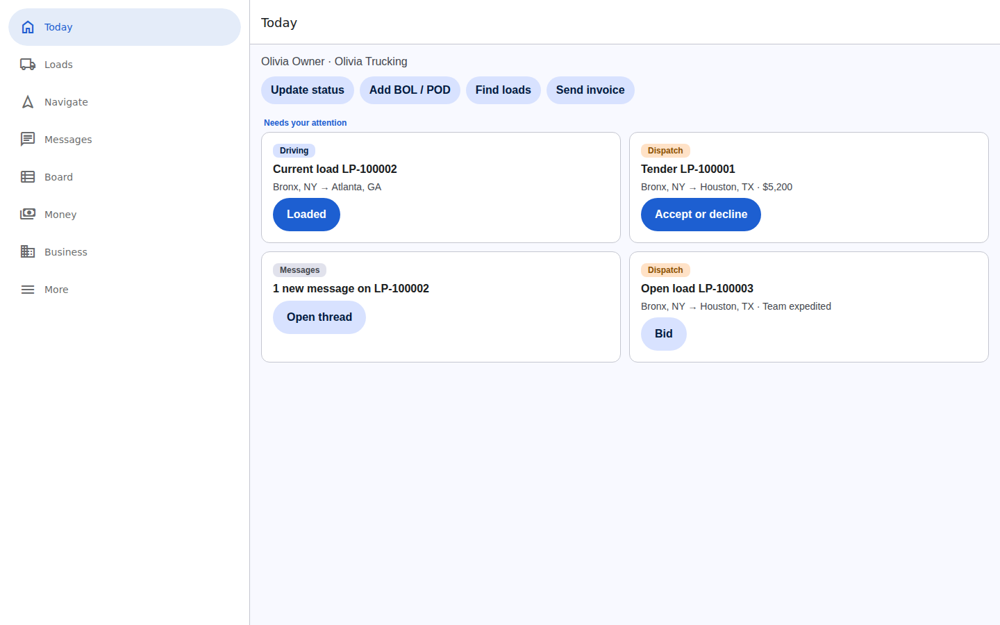
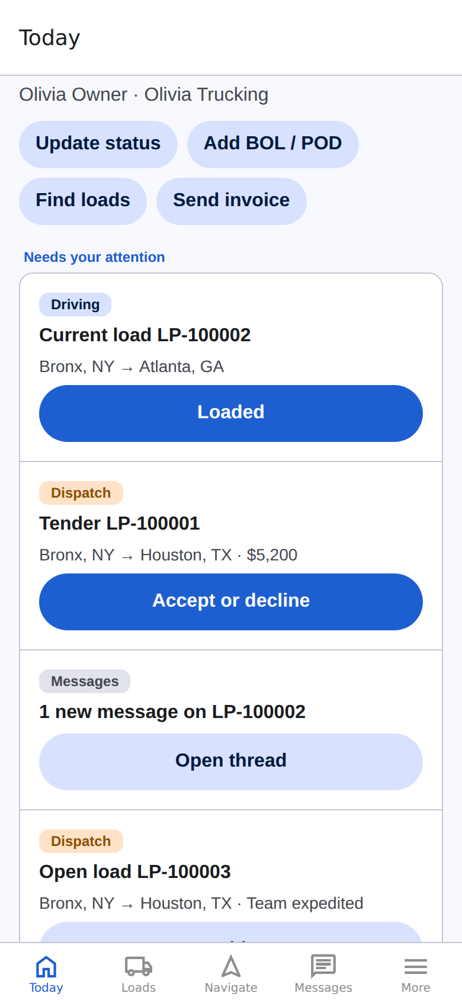
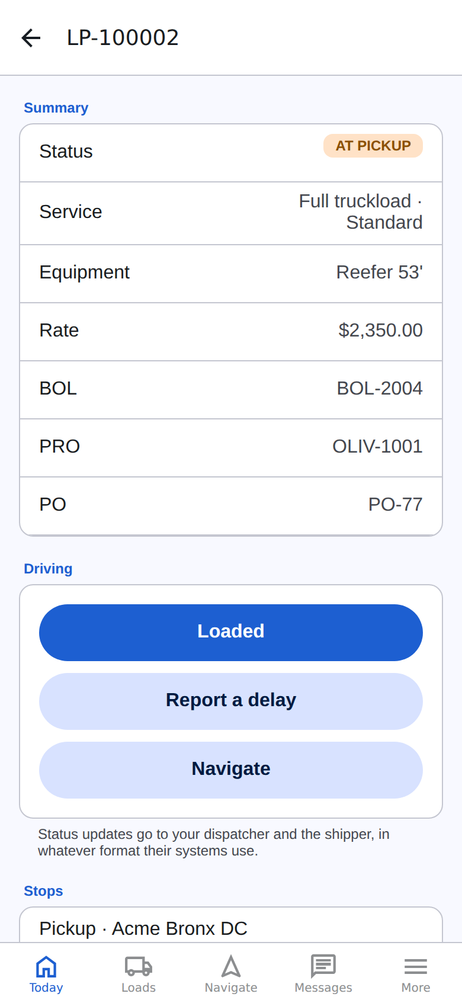
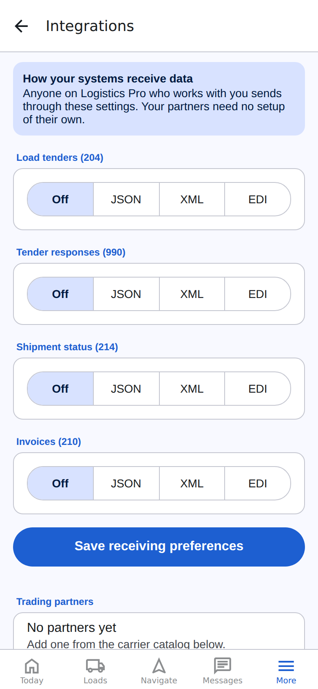

# Logistics Pro

One app and one integration hub for truckers, carriers, 3PLs and shippers.

- **Drivers** run their whole job from the phone: load details, stops, documents, one-tap status updates, messaging, truck navigation, strict permitted-route navigation for oversize loads, and invoicing.
- **Carriers** bid on brokered loads, accept tenders, split long hauls into relays, assign solo drivers or two-driver teams, consolidate LTL freight through their distribution centers, and invoice. They can run the business entirely in the app, or connect their own ERP/TMS.
- **Shippers and 3PLs** create loads, post them to the board or tender directly, refine them until pickup, and receive status and invoices in the format their systems want.
- **Integration**: every business connects once. Each one chooses, per transaction, whether it sends and receives **JSON API, XML API or EDI X12**. Estes can be on API while R+L is on EDI, Business A can receive JSON invoices while Business B receives an EDI 210, and every method carries exactly the same required fields.

**Same data on the phone and on the web.** The iOS app, the Android app and the website are one codebase talking to one API. Sign in on either and you see the same loads, messages and invoices. Phones get bottom tabs; browsers and tablets get a sidebar, a loads table, a multi-column feed and real URLs for every screen.

<p>
  
</p>

<p>
  
  
  
</p>

## Repository layout

| Path | What it is |
|---|---|
| `packages/domain` | Business model and rules: organizations, accounts, loads, lifecycle, refinement lock, relays, teams, hours-of-service estimates, arrival estimates, LTL consolidation, bids, invoices, messages. |
| `packages/integration` | The integration engine: canonical transaction schemas, JSON/XML/X12 renderers and parsers, 997 acknowledgments, partner profiles, field maps, transports, and the 25-carrier catalog. |
| `packages/navigation` | Truck routing provider (Valhalla), standard turn-by-turn with rerouting, strict oversize corridor navigation, permit and restriction checks, sunrise/sunset travel windows. |
| `packages/workspace` | Builds one layout from everything a person can do, plus a single prioritized action feed across roles. |
| `apps/api` | Fastify API server: auth with mandatory 2FA, companies, loads, board, dispatch, status, messaging, invoices, integrations, inbound API/EDI. |
| `apps/mobile` | Expo (React Native) app: iOS, Android and the website from one codebase. |
| `deploy/` | Docker Compose with the API, Valhalla (truck routing) and Nominatim (address search); a synthetic map for testing Valhalla. |
| `docs/` | [Architecture](docs/ARCHITECTURE.md), [integrations and carrier catalog](docs/INTEGRATIONS.md), [EDI and AS2](docs/EDI_AS2.md), [navigation and addresses](docs/NAVIGATION.md), [truckers, carriers and reliability](docs/NETWORK_AND_RELIABILITY.md), [live tracking, ETAs and notifications](docs/TRACKING.md), [hours of service](docs/HOURS_OF_SERVICE.md), [roadmap](docs/ROADMAP.md). |

## Quick start

Requires Node 20 or newer.

```bash
npm install
npm test                 # 118 tests across domain, integration, navigation, workspace and API
npm run typecheck        # server-side packages
npm run typecheck:mobile # the Expo app
npm run dev:api          # API on http://localhost:8080
npm run dev:mobile       # Expo dev server; press i / a / w for iOS, Android or web
npm run serve            # build the website and serve it with the API at http://localhost:8080
```

### Running the website

`npm run build:web` exports the website to `dist/web`. Start the API with `LP_WEB_DIR` pointing there and it serves the site at `/` and the API at `/v1` from the same address, so one deployment covers both. Every screen has its own URL (for example `/loads/load/<id>`), and the browser's back button, bookmarks and reloads work. In the browser the session's refresh token lives in an httpOnly cookie that page scripts cannot read.

For live-reload web development, run the API and the Expo dev server side by side:

```bash
LP_WEB_ORIGINS=http://localhost:8081 npm run dev:api
EXPO_PUBLIC_API_URL=http://localhost:8080 npm run dev:mobile   # then press w
```

Copy `.env.example` to `.env` and set `LP_JWT_SECRET` before running anywhere but your laptop. Point the app at the API with `EXPO_PUBLIC_API_URL`.

## How the requirements map to the code

| Requirement | Where it lives |
|---|---|
| One integration per business, reaching any carrier or 3PL | Receiving preferences and partner profiles in `packages/integration/src/profile.ts`; routing in `apps/api/src/services/hub.ts` |
| Same data B2B when both sides are on the platform | Both parties share one load record; the hub only transmits to systems that asked for it |
| JSON vs XML vs EDI per business, same required fields | One canonical schema per transaction in `packages/integration/src/transactions.ts`; round-trip tests prove parity |
| 210 invoices or API invoices, triggered by the trucker | `POST /v1/loads/:id/invoices`; format follows the bill-to party's choice |
| Messaging and status updates | Load threads; every status tap posts to the thread and goes out as a 214/JSON/XML where configured |
| Carrier ERP endpoints | Receiving preferences push to the carrier's ERP; inbound endpoints accept tenders and statuses by API or EDI |
| Navigation to addresses | Geocoding in `packages/navigation/src/geocode.ts`; stops are placed on the map automatically; see [docs/NAVIGATION.md](docs/NAVIGATION.md) |
| EDI send and receive, central AS2 | `packages/integration/src/as2` and `apps/api/src/routes/as2.ts`; see [docs/EDI_AS2.md](docs/EDI_AS2.md) |
| Truckers belong to carriers, join codes | `apps/api/src/routes/network.ts`; see [docs/NETWORK_AND_RELIABILITY.md](docs/NETWORK_AND_RELIABILITY.md) |
| Reliability profiles (drivers and carriers, overall and per business) | `packages/domain/src/reliability.ts`, `apps/api/src/routes/reliability.ts` |
| Push notifications for tenders and messages | `apps/api/src/services/notify.ts`, `apps/mobile/src/screens/NotificationsScreen.tsx`; see [docs/TRACKING.md](docs/TRACKING.md#tender-and-message-notifications) |
| Drivers see miles driven, miles left and legal driving time left | `packages/domain/src/hos.ts`, `apps/api/src/services/hos.ts`, `apps/mobile/src/ui/Hos.tsx`; see [docs/HOURS_OF_SERVICE.md](docs/HOURS_OF_SERVICE.md) |
| Push and scheduled alerts for late, at-risk, early or on-time shipments | `packages/domain/src/alerts.ts`, `apps/api/src/services/alerts.ts`, `apps/mobile/src/screens/AlertsScreen.tsx`; see [docs/TRACKING.md](docs/TRACKING.md#arrival-alerts) |
| Businesses ding carriers for missed appointments; truckers in several carriers only affect the carrier hauling | `AppointmentMiss` and `missedAppointmentOutcomes` in `packages/domain/src/reliability.ts`; see [docs/NETWORK_AND_RELIABILITY.md](docs/NETWORK_AND_RELIABILITY.md#missed-appointments) |
| Carriers see every truck; shippers and 3PLs see every undelivered shipment with ETA and late, at risk, on time or early | `packages/domain/src/eta.ts`, `apps/api/src/routes/tracking.ts`, `apps/mobile/src/screens/TrackScreen.tsx`; see [docs/TRACKING.md](docs/TRACKING.md) |
| Standard and oversize navigation | `packages/navigation`; the app screen is `apps/mobile/src/screens/NavigateScreen.tsx` |
| A webpage with the same data | The Expo web build, served by the API (`LP_WEB_DIR`); wide-screen layouts in `apps/mobile/src/ui/responsive.ts`, URLs in `apps/mobile/src/navigation/linking.ts` |
| Apple and Google conventions | Platform-adaptive theme and components in `apps/mobile/src/ui`; SF Symbols on iOS, Material Symbols on Android; 3–5 bottom tabs; light and dark mode |
| Accounts, profiles and two-factor | `apps/api/src/routes/auth.ts` (TOTP, recovery codes, lockout, refresh rotation) |
| One layout across roles | `packages/workspace` builds tabs and the Today feed from capabilities; there is no role switcher |
| Bid, relay, team, DC consolidation | `packages/domain/src/bid.ts` and `dispatch.ts` |
| Shipper refinement until pickup or ship confirm | `refinementLock` in `packages/domain/src/lifecycle.ts` |
| Top 25 carriers' integration capabilities | `packages/integration/src/catalog/carriers.ts`, summarized in [docs/INTEGRATIONS.md](docs/INTEGRATIONS.md) |

## Status

This is a working foundation, not a production launch. The API keeps data in memory, carrier connections still need each carrier's credentials and certification, and the phone apps have been bundled for iOS and Android and exercised in a browser, but not yet run on physical devices. [docs/ROADMAP.md](docs/ROADMAP.md) lists what remains.
