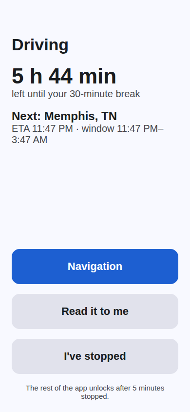

# Hours of service

Drivers see how much legal driving time they have left, why, and how far that time goes.

  
  

## What the driver sees

On **Today**, and in more detail under **More > Hours of service**:

- **Time left to drive now**, and which limit sets it: the 30-minute break, the 11-hour driving limit, the 14-hour window or the weekly cycle. At zero it says to stop and what rest is needed.
- **Miles driven this shift**, from the phone's location trail.
- **About how many more miles** the remaining time allows, at the driver's own pace this shift (50 mph until there is enough driving to measure).
- A **duty status switch**: Off duty, Sleeper, On duty, Driving.
- A meter per limit, the duty log for the last 8 days, and the weekly cycle setting.
- When resting, when a fresh 11 hours becomes available.
- A warning if the log shows a limit was exceeded.

Dispatchers see each driver's time left on the Fleet screen. A driver who works for several carriers has one set of hours across all of them, as the law counts it.

## The rules

FMCSA property-carrying rules (49 CFR 395.3):

| Limit | Rule |
|---|---|
| Driving | 11 hours after 10 consecutive hours off duty or in the sleeper berth |
| Window | No driving after the 14th hour since coming on duty; off-duty time inside the window does not extend it |
| Break | A 30-minute break from driving (off duty, sleeper or on duty not driving) after 8 hours of driving |
| Cycle | 70 hours on duty in 8 days, or 60 in 7, as the carrier runs; 34 hours off in a row restarts it |

Not modeled: split sleeper-berth pairings, the adverse driving conditions extension, the 16-hour short-haul exception and personal conveyance. Without them the clock can show less time than the law allows, never more.

## Where the duty log comes from

- **The driver** sets their status. Changes take effect now; the log is not edited after the fact.
- **The truck's movement**, as an ELD does it: while the driver has a load or is on duty, the phone reports its position about once a minute, including with the app closed if the driver allowed location "all the time". Moving over 5 mph switches the driver to **Driving**; 5 minutes stopped switches them back to **On duty**. These entries are marked **Auto**.
- On a **team truck** movement says nothing about who is at the wheel, so team drivers set their status themselves.
- GPS jumps faster than a truck can go are ignored, both for duty status and for miles.

## Driving lock

Federal rules ban drivers from holding or typing on a phone while driving. While a driver's status is Driving, the phone app covers everything with a glanceable screen:

- Time left to drive and which limit sets it.
- The next stop and its ETA.
- Three large single-tap buttons: **Navigation** (turn-by-turn stays usable), **Read it to me** (speaks the hours and next stop), and **I've stopped**, which unlocks only if the phone confirms the truck is not moving.
- On a team truck, **I'm the passenger** replaces "I've stopped", so the co-driver is not locked out.

Otherwise the app unlocks by itself after 5 minutes stopped. The website is not locked.

  

## It is not an ELD

Without a connected ELD, this is an estimate from the driver's own entries and phone. It is not a registered electronic logging device and does not replace one; the ELD's record is the legal one.

When the carrier connects its ELD (Motive, Samsara or Geotab), the clocks come from the ELD instead, every five minutes. Duty status is then changed on the ELD, not in the app. See [ELD.md](ELD.md).

API: `GET /v1/me/hos`, `POST /v1/me/duty-status`, `PUT /v1/me/hos-settings`. `GET /v1/me` includes the summary for drivers.
