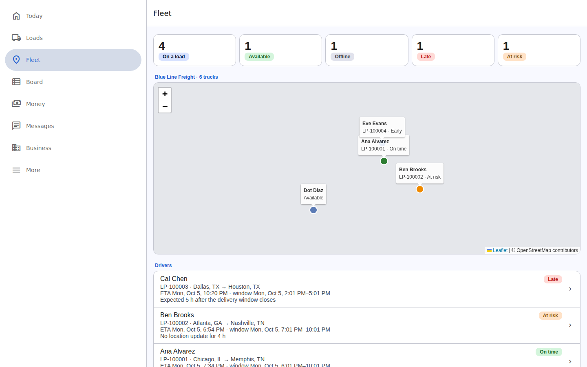
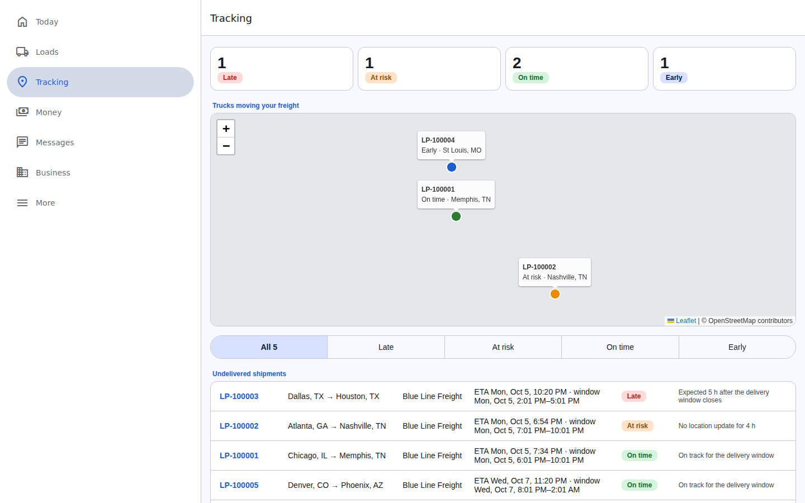
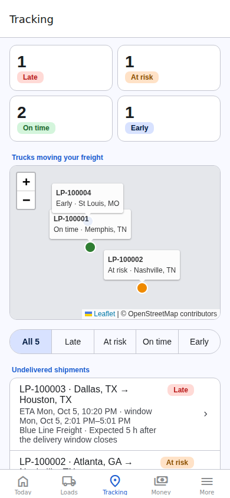
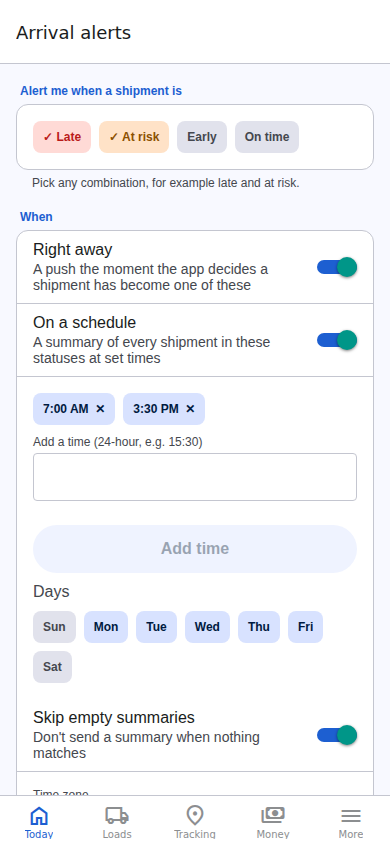
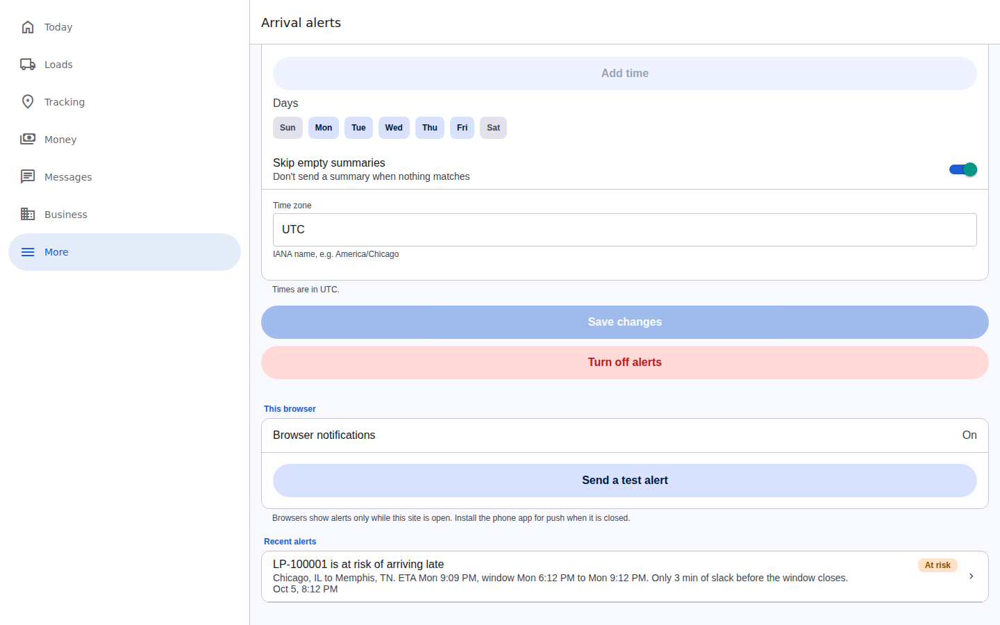
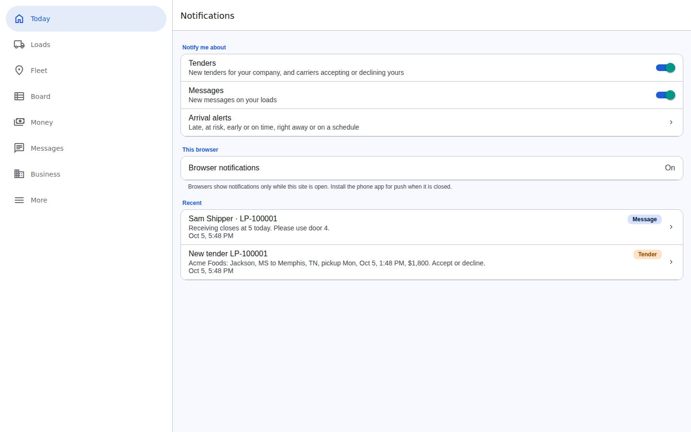

# Live tracking and arrival estimates

Carriers, shippers and 3PLs get a **Tracking** destination in the same layout everyone else uses. It is titled **Fleet** for a carrier and **Tracking** for a shipper or 3PL. A company that both ships and runs trucks sees both views with a switch at the top.

  

## Carriers: every truck under the umbrella

`GET /v1/tracking/fleet` (owners, admins and dispatchers of a carrier)

- A map with one dot per driver who has shared a location, colored by the arrival status of their load. Free drivers are gray-blue.
- Counts of trucks on a load, available and offline. A driver is offline when their phone has not reported for 2 hours.
- Every driver in the carrier, including self-employed owner-operators who registered their own carrier, with their current load, lane, ETA and status.
- Tiles for late and at-risk loads, so the dispatcher sees problems before the customer calls.

## Shippers and 3PLs: every undelivered shipment

`GET /v1/tracking/shipments` (members with the ship or broker capability)

- Every shipment from posted through at-delivery, most urgent first: late, at risk, no ETA, on time, early.
- For each shipment: load number, lane, carrier, estimated arrival date and time, the delivery window, and a status of **Late**, **At risk**, **On time** or **Early** with the reason.
- A map of the trucks carrying the shipper's freight, shown only while a truck is moving that freight. A shipper never sees where a truck is before dispatch or after delivery.
- A filter by status, and a wide table on the website.
- Late and at-risk shipments also appear on the Today feed with a Track button.

Each load's page has an **Arrival** section with the same estimate (`GET /v1/loads/:id/tracking`). Only the parties on the load see it. A driver sees only loads they are driving, not where their colleagues are.

  
  

## How the estimate works

`shipmentEta` in `packages/domain/src/eta.ts`:

1. **Where is the truck?** The newest of the driver's phone location and the location attached to their latest status update. Before pickup with no location, the estimate starts at the pickup.
2. **What is left?** The stops still ahead, skipping legs already completed in a relay. Miles are straight-line distance times a road factor.
3. **How long?** Driving time follows hours-of-service rules for a solo driver (11 h driving, 30-minute break, 10 h reset) or a team. One hour of dwell is added at every stop still ahead. Before pickup, the clock starts at the pickup window.
4. **Carrier ETA first.** If the carrier reported an ETA in the last 12 hours, by status update, API or EDI 214, that ETA wins. When it is more than an hour earlier than the computed one, the reason says so.

Then the status:

| Status | When |
|---|---|
| Late | The ETA is more than 15 minutes after the delivery window closes, or the delivery already happened after it |
| At risk | The ETA is in the window with less than 60 minutes to spare, the pickup window passed without a pickup, the truck's location is more than 2 hours old while moving, the driver reported a delay in the last 12 hours, or no driver is assigned 12 hours before pickup |
| On time | The ETA is inside the delivery window |
| Early | The ETA is before the delivery window opens |
| No ETA | There is not enough information to estimate |

## Arrival alerts

Anyone who tracks shipments (shipping staff, 3PLs and carrier dispatchers) can turn on alerts under **More > Arrival alerts**.

  
  

- **What to hear about**: any combination of **Late**, **At risk**, **Early** and **On time**. Late and at risk are preselected.
- **Right away**: a push the moment the app decides a shipment has *become* one of those statuses, for example "LP-100003 is at risk of arriving late" or "LP-100003 will be late". Tapping it opens the load.
- **On a schedule**: a summary at chosen local times on chosen days, for example 07:00 and 15:30 on weekdays: "Shipments: 2 late, 1 at risk", with the most urgent listed first. Empty summaries are skipped unless you ask for them.
- **Both** can be on at once. Times are in the person's own time zone, which the app fills in from the device.

### How the app decides

The server checks every watched shipment, tendered through at-delivery, once a minute (`LP_ALERT_INTERVAL_SECONDS`) using the same estimate as the tracking screens.

| Rule | Why |
|---|---|
| Alert only on a change of status | "Now at risk", not "still at risk" every minute |
| The first status seen for a shipment alerts only if it is late or at risk | Otherwise every new load would announce itself as on time |
| The same load and status is not pushed to the same person again within 4 hours | A shipment hovering around a threshold does not flip-flop your phone |
| A scheduled summary goes out once per slot, up to 30 minutes late after downtime | No duplicates and no stale summaries |
| Drivers are not alerted about their own loads | They already know |

Who hears about a load: members of the shipper with the ship capability, of the broker with the broker capability, and of the carrier with dispatch. Each sees only loads they are party to.

### Delivery

- **Phones** get push through Expo's push service, which relays to Apple (APNs) and Google (FCM). The app asks for notification permission only when the person turns alerts on, never at launch. Android alerts use an "Arrival alerts" channel with high importance. Signing out removes that phone. A phone that has uninstalled the app is forgotten automatically.
- **The website** cannot receive push while closed. While it is open, new alerts pop up as browser notifications, and every alert is kept in **Recent alerts** on the same screen.
- **Send a test alert** checks that a phone is set up.

### Setting up push for production

1. Create the app in EAS (`npx eas-cli@latest init`), which sets `extra.eas.projectId`. Without it, phones cannot get a push token and alerts stay in the inbox.
2. Upload Apple push credentials and a Firebase (FCM v1) service account to the Expo project (`npx eas-cli@latest credentials`).
3. Build with EAS. Push does not work in Expo Go or simulators.
4. Optionally turn on enhanced push security in Expo and set `LP_EXPO_ACCESS_TOKEN` on the API. `LP_PUSH=off` keeps alerts in the inbox only.

API: `GET/PUT/DELETE /v1/me/alert-preferences`, `POST /v1/me/alert-preferences/test`, `POST /v1/me/push-tokens`, `POST /v1/me/push-tokens/remove`, `GET /v1/me/notifications`, `POST /v1/me/notifications/read`.

## Tender and message notifications

Everyone gets these under **More > Notifications**, on by default, each with its own switch:

- **Tenders**: a carrier's dispatchers hear about a new tender the moment it arrives, whether from a shipper on the platform, an awarded bid, or a shipper's system by API or EDI 204: "New tender LP-100001. Acme Foods: Jackson, MS to Memphis, TN, pickup Mon 1:48 PM, $1,800." The shipper or broker who tendered hears when the carrier accepts or declines.
- **Messages**: a new message on a load reaches everyone else on it: the drivers, the carrier's dispatchers and the shipper's and broker's staff. Status updates are not pushed as messages. Tapping opens the thread, and reading the thread clears its notifications.

Push permission is asked for when someone turns a switch on or taps "Use this phone". Times in notifications use the phone's time zone.

  

API: `GET/PUT /v1/me/notification-settings`, `GET /v1/me/notifications`.

## Where locations come from

- **Phones**: while a driver has a load assigned, the app sends their position at most once a minute, or after 200 m of movement (`POST /v1/me/location`). The location prompt appears only once a load is underway. This works while the app is open; background location is on the [roadmap](ROADMAP.md).
- **Status updates**: every tap such as Loaded or Arrived carries the phone's position.
- **Carrier systems**: 214 status messages and API status updates can carry a location and an ETA.

## Map tiles

The website draws maps with Leaflet. By default it uses OpenStreetMap's public tiles, which are fine for development but not allowed for heavy production use under the [OSM tile usage policy](https://operations.osmfoundation.org/policies/tiles/). For production, point `EXPO_PUBLIC_MAP_TILE_URL` at a commercial tile provider or your own tile server and set `EXPO_PUBLIC_MAP_ATTRIBUTION` to match. The phone apps use Apple Maps on iOS and Google Maps on Android.

## Limits

- Distances are estimates, not road routes. Valhalla could supply exact route times later.
- Hours-of-service is estimated, not read from an ELD.
- Positions, alert settings and alert history are kept in memory with the rest of the store.
- The alert check runs in the API process. With several API servers, run it on one of them only.
